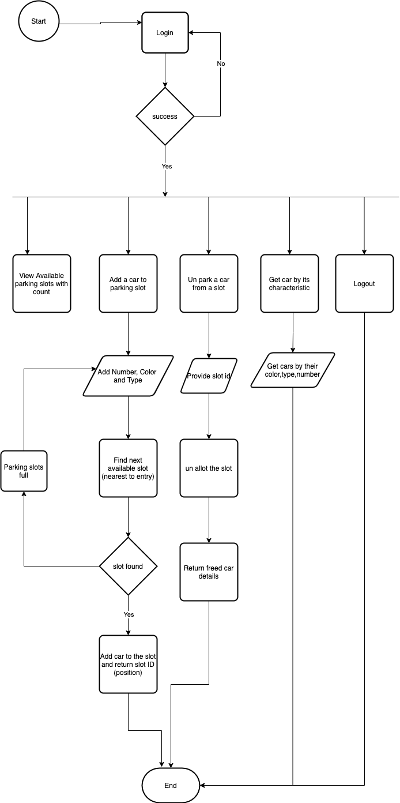

# AirAsiaParkingLot

This API is to enable an admin user to manage to park of a parking lot.

## Attachments

- [Requirement document](docs/TL_Backend_FS.pdf)
- [Frontend Demo Video](docs/frontend-demo.mp4)
- [Postman Collection](docs/api-postman-collection.json)
- [API Docs Readme](docs/API-DOCS.md)

## Tech Stack Used
- NodeJs v14
- Backend: ExpressJs v4
- Frontend: ReactJs V16
- UI/UX: bootstrap V4
- Frontend Runner: react-scripts V3
- Backend Runner: Nodemon V2
- Validation: @hapi/joi v17
- Encryption: bcrypt v5
- Firebase:  firebase-admin v9
- JWT: jsonwebtoken v8
- Bcrypt: For encryption
- DotEnv: To maintain environments

## How to Run?

### With Docker

If you have docker installed and running, you can run this app straightforwardly with thees commands:

```bash
$ cd <this-app-folder>
$ docker-compose up --build
```

### Without Docker

In case you do not have docker or want to run in on a bare server/machine, you need to run client and API in 2 separate terminals. First, open a terminal to run the backend side API:

```bash
$ cd api
$ npm i
$ cp .env.example .env
$ npm start
```
This should get the server API up and running and accessible at http://localhost:8080/ in postman. You can get and import postman collection [here](docs/api-postman-collection.json) to play with API endpoints.

Next, you need to open another terminal for client-side and hit these commands there:
```bash
$ cd client
$ npm i
$ npm start
```
This should get the client-side up and running and accessible at http://localhost:3000/ in the browser. You can have a look at the demo video [here](docs/frontend-demo.mp4) to get a better understanding.

### Demo Credentials
- Username: `furqan.dev1@gmail.com`
- Password: `password`

### FireStore Setup and Seeder
Currently, .env.example have credentials for already established firestore on test GCP account, in case you want to setup different firestore, you need to put credentials into `.env` file and hit `node api/scripts/seed-slots.js` from the root of the project to seed all slot locations.

## ERD for the database


## Flow Chart for App


## Project structure
### Client
```
public
 | - index.html
 | - required files by index.html
src
 | - components // all components of react
 | - services // service / api calls
 | - App.js // main file for react app
 | - App.css // css for App.js
 | - index.js // to render App.js
Dockerfile // contains docker instructions
package.json // npm dependencies for client app

```
### API
```
constants
 | - index.js
 | - schema.js // to hold constants and validation constants for schemas
 | - values.js // to hold constant values to be used accross the application
controllers
 | - authCtrl // for auth routes
 | - parkingCtrl // for parking routes
helpers
 | - getCarsFromSlots.js // get cars objects from slots array of objects or single array
 | - serializeSlots.js // returns slots with their ids and data
 | - index.js // to collectively export helpers
middlewares
 | - error.js // handle error of joi and app level
 | - jwt.js // token middleware
 | - index.js // to collectively export middlewares
routes
 | - auth // auth routes
 | - parking // parking routes
scripts
 | - seed-slots.js // db seed script
services
 | - firestore.js // to connect to firestore
 | - parking.js // service functions for parking
.env.example for env variables
app.js // main launching file for api
Dockerfile // contains docker instructions
package.json // npm dependencies for client app
```
### docs
```
API-DOCS.md // API documentation
api-postman-collection.json // parking lot api postman collection, to import and hit the routes locally
database-erd.png // erd 
frontend-demo.mp4 // demo video with client
park-flow-chart.png // collective flow chart
TL_Backend_FS.pdf // requirement document given
```
### Root
````
.dockerignore // ignore while dockerizing
.gitignore // ignore for git
README.md // Read me file for the api and client
````
## License
[MIT](https://choosealicense.com/licenses/mit/)
